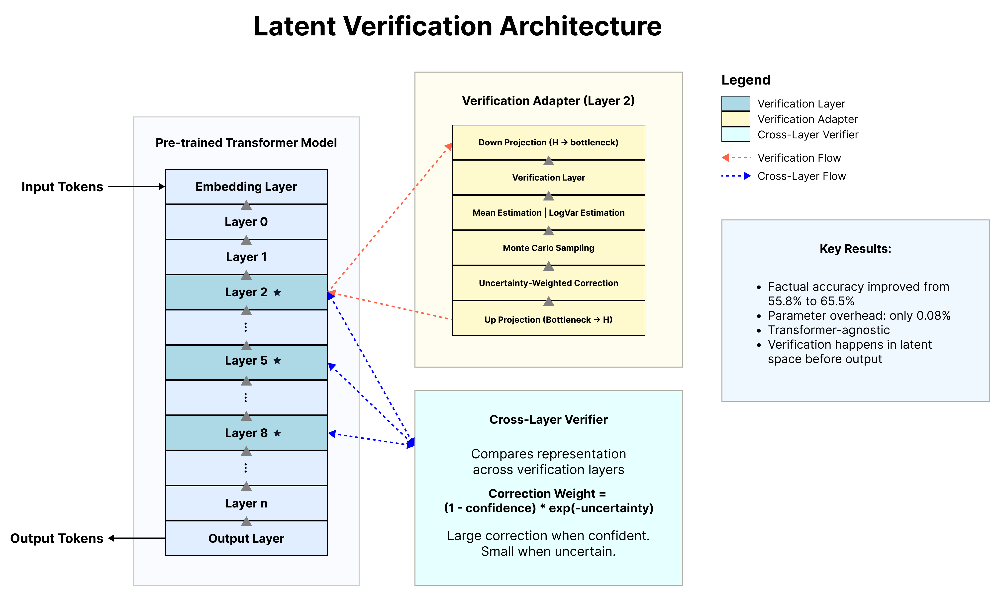
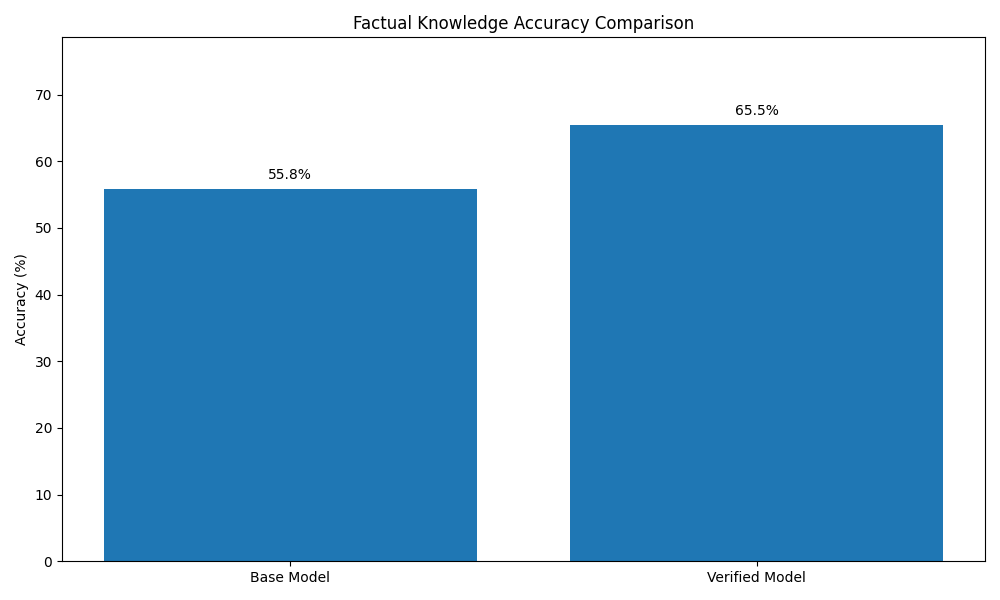
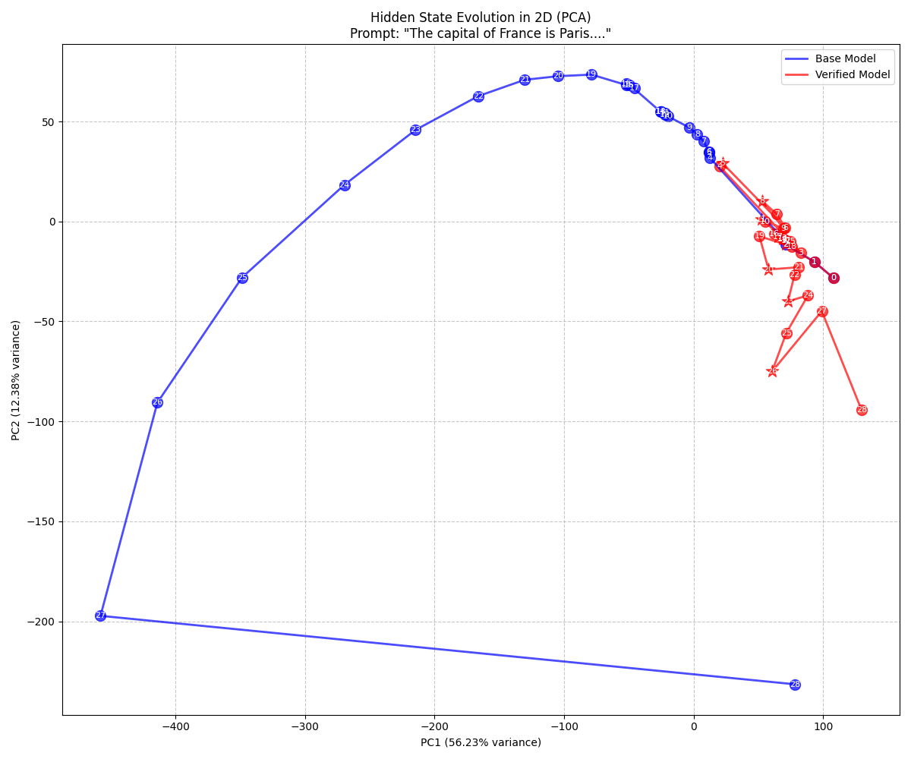

# Latent-Space Verification for Self-Correcting LLMs

[](https://github.com/jacobwarren/Latent-Space-Verification-for-Self-Correcting-LLMs/blob/main/warren2025latent.pdf) 
[](https://opensource.org/licenses/MIT)
[](https://www.python.org/downloads/release/python-31111/)
[](https://pytorch.org/)

Official implementation of **"Latent-Space Verification for Self-Correcting LLMs"**, which introduces a novel approach to enhance the factual reliability of Large Language Models through embedded verification mechanisms in latent space.

> **Note**: A ready-to-use verification-enhanced model can be downloaded from [**Hugging Face**](https://huggingface.co/jacobpwarren/Qwen2.5-7B-Latent_Verification).

## Table of Contents

- [Overview](#overview)
- [Key Features and Contributions](#key-features-and-contributions)
- [Method](#method)
  - [Latent-Space Verification Architecture](#latent-space-verification-architecture)
  - [Key Components](#key-components)
- [Installation](#installation)
- [Quick Start](#quick-start)
  - [Load a verification-enhanced model](#load-a-verification-enhanced-model)
  - [Enhance your own model with verification](#enhance-your-own-model-with-verification)
- [Usage](#usage)
  - [Training a Verification-Enhanced Model](#training-a-verification-enhanced-model)
  - [Enhanced Verification Modules](#enhanced-verification-modules)
  - [Analyzing Verification Dynamics](#analyzing-verification-dynamics)
- [Experiments and Results](#experiments-and-results)
- [Test Suite Usage](#test-suite-usage)
- [Repository Structure](#repository-structure)
- [Citation](#citation)
- [License](#license)
- [Acknowledgments](#acknowledgments)

---

## Overview

Large Language Models (LLMs) excel at generating coherent text but often produce factual inaccuracies or hallucinations, limiting their reliability in critical applications. This repository introduces **Latent-Space Verification**, a novel approach that embeds verification mechanisms directly into the hidden layers of pre-trained transformers. By detecting and rectifying inaccuracies within latent representations before output generation, my method enhances factual accuracy while requiring minimal additional parameters.

<p align="center">
  
</p>

---

## Key Features and Contributions

- **Latent-Space Verification**: My mechanism enables models to identify and rectify inaccuracies within their latent representations before generating outputs.
- **Parameter-Efficient Implementation**: Using LoRA-style adapters with only a 0.08% parameter increase (6.3M parameters on a 7.6B model).
- **Significant Performance Gains**: Improves factual accuracy from 55.81% to 65.48% (nearly 10% absolute improvement).
- **Architectural Innovations**:
  - Residual Verification Networks with a mixture-of-experts approach
  - Uncertainty-weighted Bayesian corrections
  - Hierarchical verification across different abstraction levels
- **Extensive Analysis**: Direct evidence of “thinking in latent space” through visualization of hidden state dynamics, attention patterns, and more.

---

## Method

### Latent-Space Verification Architecture

My method introduces verification modules into specific layers of a frozen pre-trained language model. These modules:

1. **Intercept hidden states** at strategic layers of the transformer  
2. **Assess factual consistency** of the internal representations  
3. **Apply confidence-weighted corrections** as needed  
4. **Coordinate cross-layer verification** to ensure global consistency  

### Key Components

- **Bayesian Verification Adapters**: Produce uncertainty-weighted corrections to hidden states  
- **Residual Verification Networks**: Use mixture-of-experts approach with dynamic routing  
- **Hierarchical Verification**: Implements verification at token, phrase, and semantic levels  
- **Cross-Layer Verifier**: Ensures consistency of representations across different layers  

---

## Installation

Tested with **Python 3.11+** and **PyTorch 2.5.1** (but should work with PyTorch 2.0.2+ as well).

```
# Clone this repository
git clone https://github.com/jacobwarren/Latent-Space-Verification-for-Self-Correcting-LLMs.git
cd Latent-Space-Verification-for-Self-Correcting-LLMs

# Create a conda environment with Python 3.11
conda create -n latent-verify python=3.11
conda activate latent-verify

# Install dependencies
pip install -r requirements.txt
```

---

## Quick Start

### Load a verification-enhanced model

```
from latent_verification.latent_verification import load_verification_model
from transformers import AutoTokenizer

# If using the downloaded model from Hugging Face:
# model = load_verification_model("jacobpwarren/Qwen2.5-7B-Latent_Verification")
# tokenizer = AutoTokenizer.from_pretrained("jacobpwarren/Qwen2.5-7B-Latent_Verification")

# Otherwise, load a local verification-enhanced model
model = load_verification_model("path/to/model")
tokenizer = AutoTokenizer.from_pretrained("path/to/model")

# Generate text with verification enabled
prompt = "The capital of France is"
inputs = tokenizer(prompt, return_tensors="pt").to(model.device)
outputs = model.generate(inputs, max_new_tokens=50)
print(tokenizer.decode(outputs[0], skip_special_tokens=True))
```

### Enhance your own model with verification

```
from transformers import AutoModelForCausalLM
from latent_verification.latent_verification import create_verification_model

# Load base model
base_model = AutoModelForCausalLM.from_pretrained("your/model/name")

# Add verification adapters (default: every 3rd layer)
verified_model = create_verification_model(
    base_model=base_model,
    adapter_locations=[2, 5, 8, 11, 14, 17, 20, 23],  # Customize adapter locations
    bottleneck_size=64,
    enable_cross_layer=True
)

# Fine-tune just the verification components
# (Base model parameters remain frozen)
# ... your fine-tuning code here ...

# Save the verification-enhanced model
verified_model.save_pretrained("path/to/save")
```

---

## Usage

### Training a Verification-Enhanced Model

For more advanced training with verification-specific loss functions, you can write a script similar to:

```
from transformers import TrainingArguments, Trainer
from latent_verification.latent_verification import (
    VerificationLoss, create_verification_model
)

# Create model with verification components
model = create_verification_model("your/model/name")

# Create verification-aware trainer
class VerificationTrainer(Trainer):
    def compute_loss(self, model, inputs, return_outputs=False):
        outputs = model(**inputs)
        
        # Use verification metrics for loss calculation
        verification_metrics = getattr(outputs, "verification_metrics", None)
        
        # Combine with regular loss
        loss_fct = VerificationLoss(
            task_loss_fn=lambda o, t: o.loss,
            consistency_weight=0.1,
            confidence_regularization_weight=0.05
        )
        
        loss = loss_fct(outputs, inputs["labels"], verification_metrics)
        return (loss, outputs) if return_outputs else loss

# Training arguments
training_args = TrainingArguments(
    output_dir="./verification_model",
    per_device_train_batch_size=4,
    gradient_accumulation_steps=4,
    learning_rate=1e-5,
    num_train_epochs=3,
)

# Initialize trainer
trainer = VerificationTrainer(
    model=model,
    args=training_args,
    train_dataset=your_dataset,
)

# Train
trainer.train()
```

### Enhanced Verification Modules

For advanced verification capabilities, see `enhanced_verification.py`:

```
from latent_verification.enhanced_verification import (
    create_enhanced_verification_model,
    BayesianVerificationAdapter,
    HierarchicalVerifier,
    ResidualVerificationNetwork
)

# Create a model with Bayesian uncertainty estimation
bayesian_model = create_enhanced_verification_model(
    model_name_or_path="your/model/name",
    verification_type="bayesian"
)

# Create a model with hierarchical verification
hierarchical_model = create_enhanced_verification_model(
    model_name_or_path="your/model/name",
    verification_type="hierarchical"
)

# Create a model with residual verification networks
residual_model = create_enhanced_verification_model(
    model_name_or_path="your/model/name",
    verification_type="residual"
)

# And so forth...
```

### Analyzing Verification Dynamics

The `analysis` folder provides specialized tools to visualize and analyze verification behavior:

```
# Example usage of confidence analysis
from analysis import 5-confidence_analyzer  # or run as a script

# Or from code (hypothetically):
from analysis.confidence_analyzer import ConfidenceAnalyzer

confidence_analyzer = ConfidenceAnalyzer(
    verified_model_path="path/to/verified/model",
    base_model_name="original/model/name",
    output_dir="confidence_analysis"
)
confidence_results = confidence_analyzer.analyze_truth_falsehood_confidence()
```

---

## Experiments and Results

My experiments demonstrate that latent-space verification significantly improves factual accuracy across multiple benchmarks:

### Factual Knowledge Accuracy

- **Base Model**: 55.81%  
- **Verification-Enhanced Model**: 65.48%  
- **Absolute Improvement**: 9.67%

With minimal parameter overhead: only a 0.08% parameter increase (6.3M additional parameters on a 7.6B model).

<p align="center">
  
</p>

### Evidence of Latent Thinking

My analysis provides direct evidence for the "thinking in latent space" hypothesis:

<p align="center">
  
</p>

- Verification layers create systematic transformations in embedding space  
- Vector fields demonstrate directional correction patterns  
- Confidence scores correlate with factual accuracy  
- Token probability analysis shows shifts toward accurate completions  

### Ablation Studies

Key findings from my ablation studies:

- **Cross-layer verification** is critical (37% reduction in improvement when disabled)  
- **Learned confidence** outperforms fixed confidence thresholds by 43%  
- **Layer placement** significantly impacts performance (middle layers contribute most)  
- **Verification depth** affects different error types (early layers catch syntactic errors, late layers address semantic/factual issues)

---

## Test Suite Usage

This repository provides a suite of scripts (numbered `1-` through `8-`) to train, evaluate, and analyze verification-enhanced models, plus an all-in-one `evaluation_suite.py`. Below is a high-level guide. All scripts assume you have installed the required dependencies (see [Installation](#installation)).

1. **Train the model** using the example training script in `examples/training_script.py`:

```
cd examples
python training_script.py \
    --model Qwen/Qwen2.5-1.5B-Instruct \
    --verification_type bayesian \
    --output_dir verification_model \
    --batch_size 1 \
    --gradient_accumulation_steps 16 \
    --epochs 1 \
    --max_samples 49664
```

   - Wraps your chosen model with verification adapters.
   - Applies custom verification-based loss terms.
   - Trains only the new verification components (base model is frozen).

2. **Save the trained model** (e.g. in `verification_model/model`).  

3. **Run analysis scripts** in the `analysis` directory. Typically:

```
cd ../analysis

# 1) Evaluate verification performance
python 1-verification_evaluation.py

# 2) Create parameter-matched baselines
python 2-create_parameter_matched_baselines.py \
    --model_name Qwen/Qwen2.5-7B-Instruct \
    --verification_model ../verification_model/model \
    --adapter_output ./adapter_baseline \
    --lora_output ./lora_baseline \
    --mlp_output ./mlp_baseline \
    --device cuda

# 3) Generate ablation models
python 3-generate_ablation_models.py \
    --model_path ../verification_model/model \
    --output_dir ./ablation_models \
    --tokenizer_path Qwen/Qwen2.5-7B-Instruct

# 4) Generate benchmark data
python 4-generate_benchmark_data.py \
    --categories all \
    --samples 200 \
    --output_dir ./verification_benchmarks

# 5) Run confidence analysis
python 5-confidence_analyzer.py \
    --verified_model ../verification_model/model \
    --base_model Qwen/Qwen2.5-7B-Instruct \
    --output_dir ./confidence_analysis \
    --device cuda \
    --run_all

# 6) Analyze "latent thinking"
python 6-latent_thinking_analyzer.py \
    --base_model Qwen/Qwen2.5-7B-Instruct \
    --verified_model ../verification_model/model \
    --output_dir ./latent_thinking_analysis \
    --all

# 7) Analyze embedding dynamics
python 7-embedding_dynamics_analyzer.py \
    --verified_model ../verification_model/model \
    --base_model Qwen/Qwen2.5-7B-Instruct \
    --output_dir ./embedding_dynamics \
    --device cuda \
    --high_quality \
    --run_all

# 8) Perform hidden-state verification checks
python 8-hidden_state_verification.py
```

---

## Repository Structure

```
latent-space/
├── analysis/
│   ├── __init__.py
│   ├── 1-verification_evaluation.py
│   ├── 2-create_parameter_matched_baselines.py
│   ├── 3-generate_ablation_models.py
│   ├── 4-generate_benchmark_data.py
│   ├── 5-confidence_analyzer.py
│   ├── 6-latent_thinking_analyzer.py
│   ├── 7-embedding_dynamics_analyzer.py
│   ├── 8-hidden_state_verification.py
│   ├── evaluation_suite.py
│   └── verification_benchmarks/ # benchmark datasets for local use
├── examples/
│   ├── __init__.py
│   └── training_script.py
├── latent_verification/
│   ├── __init__.py
│   ├── detect_qwen_layers.py
│   ├── enhanced_verification.py
│   └── latent_verification.py
├── requirements.txt
└── README.md
```

---

## Citation

If you use this work in your research, please cite my GitHub repository:

### BibTeX

```
@misc{warren2025latent,
  title={Latent-Space Verification for Self-Correcting LLMs},
  author={Warren, Jacob},
  year={2025},
  publisher={GitHub},
  journal={GitHub repository},
  howpublished={\url{https://github.com/jacobwarren/Latent-Space-Verification-for-Self-Correcting-LLMs}}
}
```

### APA

Warren, J. (2025). *Latent-Space Verification for Self-Correcting LLMs* [Computer software]. GitHub. https://github.com/jacobwarren/Latent-Space-Verification-for-Self-Correcting-LLMs

### MLA

Warren, Jacob. "Latent-Space Verification for Self-Correcting LLMs." GitHub, 2025, github.com/jacobwarren/Latent-Space-Verification-for-Self-Correcting-LLMs.

### IEEE

J. Warren, "Latent-Space Verification for Self-Correcting LLMs," GitHub, 2025. [Online]. Available: https://github.com/jacobwarren/Latent-Space-Verification-for-Self-Correcting-LLMs

---

## License

This project is licensed under the MIT License - see the [LICENSE](LICENSE) file for details.

---

## Acknowledgments

- This research was conducted independently.  
- I thank the HuggingFace team for their transformer implementations.  
- Experiments were conducted using Qwen 2.5 models at both 1.5B and 7B parameter scales.

